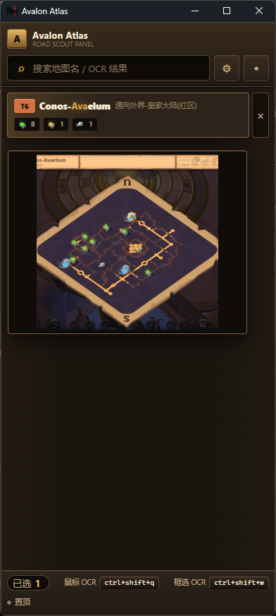

# Avalon Atlas

[中文](README.md)

[](https://github.com/Pililink/Avalon-Atlas/releases)
[](https://github.com/Pililink/Avalon-Atlas/actions/workflows/release.yml)
[](LICENSE)
[](https://tauri.app/)
[](https://svelte.dev/)

Avalon Atlas is a compact Windows desktop assistant for looking up Albion Online Avalon road maps. It is designed to sit beside the game window, provide fast map search, and use OCR hotkeys to capture map names from the screen.

The current application is built with Tauri v2, Svelte 5, TypeScript, and Rust.

> Unofficial community tool for Albion Online. Avalon Atlas does not require game account credentials and OCR runs locally.

## Screenshot



## Features

- Fast fuzzy search for Avalon map names, including typo-tolerant and subsequence matching.
- Compact in-game assistant style UI with selected-map list and map preview.
- Map details for tier, route type, chests, dungeons, resources, and Brecilien access.
- Mouse OCR hotkey for reading the map name near the cursor.
- Region OCR hotkey for selecting an on-screen area and detecting multiple map names.
- Customizable global hotkeys.
- Always-on-top window mode.
- Chinese and English UI.
- Portable Windows release with bundled Tesseract OCR runtime.

## Download

Download the latest Windows portable package from GitHub Releases:

https://github.com/Pililink/Avalon-Atlas/releases

Use the `avalon-atlas-v<version>-portable.zip` asset. Extract it and run `avalon-atlas.exe`.

The portable package contains:

```text
avalon-atlas.exe
config.json
static/
binaries/
logs/
README.txt
```

Logs are written to the `logs/` directory next to the executable.

## Usage

### Search

Type part of a map name in the search box, then select a result from the list. Selected maps remain visible for quick comparison, and hovering a selected map shows its preview image.

### Mouse OCR

Default hotkey: `Ctrl+Shift+Q`

Move the cursor over a map icon in the game and wait for the map name tooltip to appear. Press the hotkey while the tooltip is visible. Avalon Atlas captures a small region near the cursor, runs OCR on the tooltip text, and selects the matching known map only when the result is confident.

### Region OCR

Default hotkey: `Ctrl+Shift+W`

Press the hotkey, drag over any screen area that contains map names, and release. The app recognizes text in the selected area and adds matching maps to the list.

Good targets include chat logs, screenshots, webpages, and in-game text regions where multiple map names may appear.

### Settings

Open settings from the app toolbar to change:

- Mouse OCR hotkey
- Region OCR hotkey
- UI language
- OCR debug image saving

Settings are saved to `config.json`.

## Development

### Requirements

- Windows 10/11 64-bit
- Node.js 22 or newer
- Rust stable toolchain
- Microsoft C++ Build Tools / Windows SDK for Tauri builds

### Install

```bash
npm install
```

### Run Desktop App

```bash
npm run tauri dev
```

Tauri starts the Vite dev server on `http://localhost:1420`.

### Run Frontend Only

```bash
npm run dev
```

Frontend-only mode is useful for UI work. Tauri IPC, OCR, global hotkeys, and always-on-top behavior require `npm run tauri dev`.

### Check

```bash
npm run check
cargo test --manifest-path src-tauri/Cargo.toml
```

### Build

Build the Tauri app without generating installers:

```bash
npm run tauri build -- --no-bundle
```

Main build outputs:

```text
build/frontend/
build/target/release/avalon-atlas.exe
```

Create the portable distribution directory and zip:

```bash
npm run package:portable
```

Portable outputs:

```text
build/portable/avalon-atlas-v<version>-portable/
build/portable/avalon-atlas-v<version>-portable.zip
```

## Release

GitHub Actions builds and publishes Windows portable releases when a `v*` tag is pushed.

```bash
git tag v2.0.1
git push origin v2.0.1
```

The tag version must match:

- `package.json`
- `src-tauri/tauri.conf.json`
- `src-tauri/Cargo.toml`

The release workflow runs dependency installation, frontend checks, portable packaging, package verification, and uploads the zip to GitHub Releases.

## Project Structure

```text
Avalon-Atlas/
├── .github/workflows/      # CI and release workflows
├── docs/                   # Design and maintenance notes
├── public/static/          # Map data, previews, and UI assets
├── scripts/                # Portable packaging scripts
├── src/                    # Svelte frontend
├── src-tauri/              # Rust/Tauri backend
├── index.html
├── package.json
└── vite.config.ts
```

Important paths:

- `public/static/data/maps.json`: map metadata.
- `public/static/maps/`: map preview images.
- `src/lib/i18n/`: Chinese and English UI strings.
- `src-tauri/binaries/tesseract/`: bundled Tesseract runtime.
- `src-tauri/binaries/tessdata/`: bundled OCR language data.
- `src-tauri/src/services/`: search, OCR, hotkey, and supporting services.

More maintenance notes are available in [docs/](docs/README.md).

## Configuration

`config.json` is created automatically when missing. The default configuration is:

```json
{
  "mouse_hotkey": "ctrl+shift+q",
  "chat_hotkey": "ctrl+shift+w",
  "ocr_debug": true,
  "ocr_region": {
    "width": 590,
    "height": 30,
    "vertical_offset": 50
  },
  "always_on_top": false,
  "debounce_ms": 200,
  "language": "zh-CN"
}
```

Supported languages are `zh-CN` and `en-US`.

## Contributing

Issues and pull requests are welcome. See [CONTRIBUTING.md](CONTRIBUTING.md) before opening a pull request.

For code changes, keep the scope focused and run the relevant checks before submitting:

```bash
npm run check
cargo test --manifest-path src-tauri/Cargo.toml
```

For release or packaging changes, also verify:

```bash
npm run package:portable
```

## Disclaimer

Avalon Atlas is an unofficial community tool. It is not affiliated with, endorsed by, or sponsored by Sandbox Interactive or Albion Online.

Use OCR and global hotkeys responsibly and follow the rules of the software and game environment where you run it.

## License

This project is licensed under the MIT License. See [LICENSE](LICENSE).
