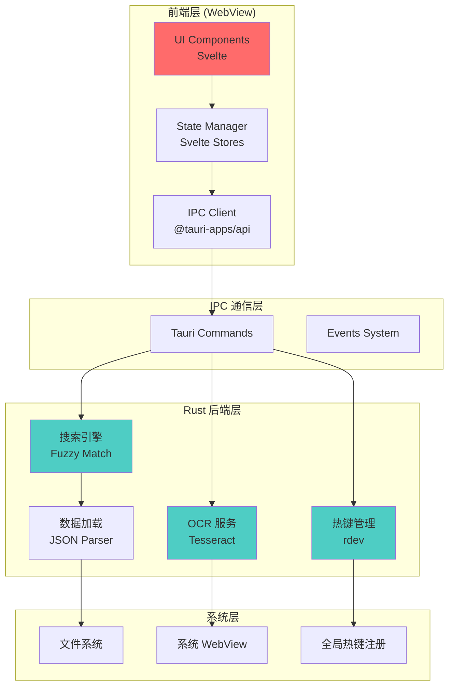

# Avalon Atlas - Tauri 重构设计方案

> 版本: v2.0  
> 作者: Development Team  
> 日期: 2026-01-10  
> 目标: 将现有 PySide6 应用重构为轻量高性能的 Tauri 桌面应用

---

## 📋 目录

- [1. 项目背景](#1-项目背景)
- [2. 重构目标](#2-重构目标)
- [3. 技术栈选型](#3-技术栈选型)
- [4. 架构设计](#4-架构设计)
- [5. 核心功能实现](#5-核心功能实现)
- [6. 实施路线图](#6-实施路线图)
- [7. 性能对比](#7-性能对比)
- [8. 风险评估](#8-风险评估)

---

## 1. 项目背景

### 1.1 现有技术栈问题

| 组件 | 当前技术 | 存在问题 |
|------|---------|---------|
| **GUI 框架** | PySide6 (Qt6) | 打包体积 ~500MB，启动慢 (2-3s) |
| **打包工具** | PyInstaller | 依赖冗余，无法优化体积 |
| **运行时** | Python 解释器 | 性能瓶颈，内存占用高 |
| **OCR 引擎** | RapidOCR + ONNX | 模型文件 ~50MB |

### 1.2 用户痛点

- ⏳ **启动缓慢**: 冷启动需要 2-3 秒
- 💾 **体积臃肿**: 下载包超过 500MB
- 🐢 **搜索延迟**: 大量数据时响应延迟明显
- 🔧 **更新困难**: 需要重新下载完整安装包

---

## 2. 重构目标

### 2.1 性能指标

| 指标 | 当前 | 目标 | 提升 |
|------|------|------|------|
| **打包体积** | ~500MB | **<15MB** | 📉 97% ↓ |
| **冷启动时间** | 2-3s | **<300ms** | ⚡ 90% ↓ |
| **内存占用** | ~150MB | **<50MB** | 📊 66% ↓ |
| **搜索响应** | ~100ms | **<10ms** | 🚀 90% ↓ |

### 2.2 功能增强

- ✅ 保留所有现有功能
- 🎨 更现代化的 UI 设计
- 🔥 支持热更新（前端资源）
- 📱 预留跨平台能力（macOS/Linux）
- 🌐 可选的 WebDAV 云同步

---

## 3. 技术栈选型

### 3.1 核心框架

```yaml
桌面框架: Tauri v2.0+
  优势:
    - Rust 核心，性能卓越
    - 使用系统 WebView，体积极小
    - 安全性高（编译期检查）
    - 社区活跃，生态成熟

前端框架: Svelte 5 + Vite
  优势:
    - 无虚拟 DOM，速度最快
    - 打包体积最小
    - 编译时优化
    - 学习曲线平缓

样式方案: Vanilla CSS + CSS Variables
  理由:
    - 无需引入 Tailwind 等框架
    - 减少构建体积
    - 浏览器原生支持
```

### 3.2 关键依赖

**Rust 侧 (src-tauri/Cargo.toml):**
```toml
[dependencies]
tauri = "2.0"
serde = { version = "1.0", features = ["derive"] }
serde_json = "1.0"
tokio = { version = "1", features = ["full"] }
rusty-tesseract = "1.1"  # OCR 引擎
rdev = "0.5"  # 全局热键
screenshots = "0.8"  # 截图
similar = "2.2"  # 模糊匹配
parking_lot = "0.12"  # 高性能锁
```

**前端侧 (package.json):**
```json
{
  "dependencies": {
    "svelte": "^5.0.0"
  },
  "devDependencies": {
    "@tauri-apps/api": "^2.0.0",
    "@tauri-apps/plugin-global-shortcut": "^2.0.0",
    "vite": "^5.0.0",
    "@sveltejs/vite-plugin-svelte": "^4.0.0"
  }
}
```

---

## 4. 架构设计

### 4.1 整体架构



### 4.2 目录结构

```
avalon-atlas-v2/
├── src-tauri/              # Rust 后端
│   ├── src/
│   │   ├── main.rs         # 入口
│   │   ├── commands/       # Tauri 命令
│   │   │   ├── mod.rs
│   │   │   ├── search.rs   # 搜索命令
│   │   │   ├── ocr.rs      # OCR 命令
│   │   │   └── config.rs   # 配置命令
│   │   ├── services/       # 核心服务
│   │   │   ├── search_engine.rs
│   │   │   ├── ocr_service.rs
│   │   │   └── hotkey_manager.rs
│   │   ├── models/         # 数据模型
│   │   │   ├── map.rs
│   │   │   └── config.rs
│   │   └── utils/          # 工具函数
│   │       ├── fuzzy.rs
│   │       └── image.rs
│   ├── Cargo.toml
│   └── tauri.conf.json     # Tauri 配置
│
├── src/                    # Svelte 前端
│   ├── lib/
│   │   ├── components/     # UI 组件
│   │   │   ├── SearchBox.svelte
│   │   │   ├── MapCard.svelte
│   │   │   ├── MapDetail.svelte
│   │   │   └── Settings.svelte
│   │   ├── stores/         # 状态管理
│   │   │   ├── maps.ts
│   │   │   ├── config.ts
│   │   │   └── ui.ts
│   │   └── utils/          # 前端工具
│   │       ├── ipc.ts      # IPC 封装
│   │       └── format.ts
│   ├── App.svelte          # 根组件
│   └── main.ts             # 入口
│
├── public/
│   └── static/             # 静态资源
│       ├── data/
│       │   └── maps.json
│       └── maps/           # 地图图片
│
├── package.json
└── vite.config.js
```

---

## 5. 核心功能实现

### 5.1 搜索引擎 (Rust)

#### 5.1.1 数据结构

```rust
// src-tauri/src/models/map.rs
use serde::{Deserialize, Serialize};

#[derive(Debug, Clone, Serialize, Deserialize)]
pub struct MapRecord {
    pub name: String,
    pub slug: String,
    pub tier: String,
    pub map_type: String,
    pub chests: Chests,
    pub dungeons: Dungeons,
    pub resources: Resources,
    pub brecilien: u32,
}

#[derive(Debug, Clone, Serialize, Deserialize)]
pub struct Chests {
    pub blue: u32,
    pub green: u32,
    pub high_gold: u32,
    pub low_gold: u32,
}

#[derive(Debug, Clone, Serialize, Deserialize)]
pub struct SearchResult {
    pub record: MapRecord,
    pub score: f64,
    pub method: String,
    #[serde(skip_serializing_if = "Option::is_none")]
    pub positions: Option<Vec<usize>>,
}
```

#### 5.1.2 模糊匹配算法

```rust
// src-tauri/src/services/search_engine.rs
use parking_lot::RwLock;
use std::collections::HashMap;
use std::sync::Arc;

pub struct SearchEngine {
    records: Arc<Vec<MapRecord>>,
    cache: Arc<RwLock<HashMap<String, Vec<SearchResult>>>>,
}

impl SearchEngine {
    pub fn new(records: Vec<MapRecord>) -> Self {
        Self {
            records: Arc::new(records),
            cache: Arc::new(RwLock::new(HashMap::new())),
        }
    }

    pub fn search(&self, query: &str, max_results: usize) -> Vec<SearchResult> {
        let query_lower = query.to_lowercase();
        
        // 检查缓存
        {
            let cache = self.cache.read();
            if let Some(results) = cache.get(&query_lower) {
                return results.clone();
            }
        }

        // 并行搜索
        let results: Vec<SearchResult> = self.records
            .par_iter()  // 使用 rayon 并行迭代
            .filter_map(|record| {
                let detail = subsequence_match(&query_lower, &record.slug)?;
                Some(SearchResult {
                    record: record.clone(),
                    score: detail.score,
                    method: "subsequence".to_string(),
                    positions: Some(detail.positions),
                })
            })
            .collect();

        // 排序并缓存
        let mut results = results;
        results.sort_by(|a, b| {
            b.score.partial_cmp(&a.score)
                .unwrap_or(std::cmp::Ordering::Equal)
                .then_with(|| a.record.tier.cmp(&b.record.tier))
        });
        results.truncate(max_results);

        self.cache.write().insert(query_lower, results.clone());
        results
    }
}

// 动态规划模糊匹配
fn subsequence_match(query: &str, target: &str) -> Option<MatchDetail> {
    const BASE_SCORE: f64 = 10.0;
    const ADJACENT_BONUS: f64 = 14.0;
    const WORD_START_BONUS: f64 = 8.0;
    const GAP_PENALTY: f64 = 2.0;

    let query_chars: Vec<char> = query.chars().collect();
    let target_chars: Vec<char> = target.chars().collect();
    let m = query_chars.len();
    let n = target_chars.len();

    if m > n {
        return None;
    }

    let mut dp = vec![vec![f64::NEG_INFINITY; n]; m];
    let mut backtrack = vec![vec![-1i32; n]; m];

    // 初始化第一行
    for (j, &ch) in target_chars.iter().enumerate() {
        if chars_match(query_chars[0], ch) {
            dp[0][j] = score_position(&target_chars, j, None);
        }
    }

    // DP 填表
    for i in 1..m {
        for (j, &ch) in target_chars.iter().enumerate().skip(i) {
            if !chars_match(query_chars[i], ch) {
                continue;
            }
            let mut best_score = f64::NEG_INFINITY;
            let mut best_prev = -1;
            
            for k in 0..j {
                if dp[i - 1][k].is_finite() {
                    let score = dp[i - 1][k] + score_position(&target_chars, j, Some(k));
                    if score > best_score {
                        best_score = score;
                        best_prev = k as i32;
                    }
                }
            }
            dp[i][j] = best_score;
            backtrack[i][j] = best_prev;
        }
    }

    // 回溯获取最佳路径
    let (best_idx, &best_score) = dp[m - 1]
        .iter()
        .enumerate()
        .max_by(|(_, a), (_, b)| a.partial_cmp(b).unwrap())?;

    if !best_score.is_finite() {
        return None;
    }

    let mut positions = vec![0; m];
    let mut idx = best_idx;
    for i in (0..m).rev() {
        positions[i] = idx;
        if i > 0 {
            idx = backtrack[i][idx] as usize;
        }
    }

    Some(MatchDetail {
        score: best_score,
        positions,
    })
}

fn chars_match(a: char, b: char) -> bool {
    if a == b {
        return true;
    }
    match a {
        'i' | 'l' | '1' | '|' => matches!(b, 'i' | 'l' | '1' | '|'),
        'o' | '0' => matches!(b, 'o' | '0'),
        's' | '5' => matches!(b, 's' | '5'),
        'z' | '2' => matches!(b, 'z' | '2'),
        _ => false,
    }
}
```

#### 5.1.3 Tauri 命令

```rust
// src-tauri/src/commands/search.rs
use tauri::State;
use crate::services::search_engine::SearchEngine;

#[tauri::command]
pub async fn search_maps(
    query: String,
    max_results: Option<usize>,
    engine: State<'_, Arc<SearchEngine>>,
) -> Result<Vec<SearchResult>, String> {
    if query.len() < 2 {
        return Ok(vec![]);
    }
    
    let results = engine.search(&query, max_results.unwrap_or(25));
    Ok(results)
}
```

---

### 5.2 OCR 服务 (Rust)

```rust
// src-tauri/src/services/ocr_service.rs
use rusty_tesseract::{Args, Image};
use screenshots::Screen;
use image::{DynamicImage, imageops};

pub struct OcrService {
    config: OcrConfig,
}

impl OcrService {
    pub fn capture_text(&self, mouse_x: i32, mouse_y: i32) -> Result<String, String> {
        // 1. 截图
        let screen = Screen::all()
            .map_err(|e| format!("获取屏幕失败: {}", e))?
            .into_iter()
            .next()
            .ok_or("无可用屏幕")?;

        let region = (
            mouse_x - self.config.width / 2,
            mouse_y - self.config.height,
            self.config.width as u32,
            self.config.height as u32,
        );

        let image = screen.capture_area(
            region.0,
            region.1,
            region.2,
            region.3,
        ).map_err(|e| format!("截图失败: {}", e))?;

        // 2. 预处理
        let processed = self.preprocess_image(image);

        // 3. OCR 识别
        let args = Args {
            lang: "eng".to_string(),
            config_variables: hashmap! {
                "tessedit_char_whitelist".to_string() => "ABCDEFGHIJKLMNOPQRSTUVWXYZabcdefghijklmnopqrstuvwxyz-".to_string(),
            },
            ..Default::default()
        };

        let text = rusty_tesseract::image_to_string(&processed, &args)
            .map_err(|e| format!("OCR 失败: {}", e))?;

        // 4. 标准化
        Ok(self.normalize_text(&text))
    }

    fn preprocess_image(&self, img: DynamicImage) -> DynamicImage {
        let mut img = img.grayscale();
        
        // 对比度增强
        img = imageops::contrast(&img, 50.0);
        
        // 锐化
        img = img.unsharpen(1.0, 1);
        
        img
    }

    fn normalize_text(&self, text: &str) -> String {
        text.to_lowercase()
            .chars()
            .map(|c| match c {
                '0' => 'o',
                '1' | '|' => 'l',
                '5' => 's',
                _ => c,
            })
            .filter(|c| c.is_ascii_alphabetic() || *c == '-')
            .collect()
    }
}
```

---

### 5.3 前端实现 (Svelte)

#### 5.3.1 搜索组件

```svelte
<!-- src/lib/components/SearchBox.svelte -->
<script lang="ts">
  import { invoke } from '@tauri-apps/api/core';
  import { searchResults, isSearching } from '$lib/stores/maps';
  import { debounce } from '$lib/utils/debounce';

  let query = $state('');

  const performSearch = debounce(async (q: string) => {
    if (q.length < 2) {
      searchResults.set([]);
      return;
    }

    isSearching.set(true);
    try {
      const results = await invoke('search_maps', { 
        query: q,
        maxResults: 25 
      });
      searchResults.set(results);
    } catch (error) {
      console.error('搜索失败:', error);
    } finally {
      isSearching.set(false);
    }
  }, 200);

  $effect(() => {
    performSearch(query);
  });
</script>

<div class="search-box">
  <input
    type="text"
    bind:value={query}
    placeholder="输入地图名称..."
    class="search-input"
  />
  {#if $isSearching}
    <div class="spinner"></div>
  {/if}
</div>

<style>
  .search-box {
    position: relative;
    width: 100%;
  }

  .search-input {
    width: 100%;
    padding: 12px 16px;
    font-size: 16px;
    border: 2px solid var(--border-color);
    border-radius: 8px;
    background: var(--input-bg);
    color: var(--text-color);
    transition: border-color 0.2s;
  }

  .search-input:focus {
    outline: none;
    border-color: var(--primary-color);
  }

  .spinner {
    position: absolute;
    right: 12px;
    top: 50%;
    transform: translateY(-50%);
    width: 20px;
    height: 20px;
    border: 2px solid var(--primary-color);
    border-top-color: transparent;
    border-radius: 50%;
    animation: spin 0.8s linear infinite;
  }

  @keyframes spin {
    to { transform: translateY(-50%) rotate(360deg); }
  }
</style>
```

#### 5.3.2 IPC 封装

```typescript
// src/lib/utils/ipc.ts
import { invoke } from '@tauri-apps/api/core';
import { listen } from '@tauri-apps/api/event';

export interface MapRecord {
  name: string;
  slug: string;
  tier: string;
  map_type: string;
  chests: {
    blue: number;
    green: number;
    high_gold: number;
    low_gold: number;
  };
  dungeons: {
    solo: number;
    group: number;
    avalon: number;
  };
  resources: {
    rock: number;
    wood: number;
    ore: number;
    fiber: number;
    hide: number;
  };
  brecilien: number;
}

export interface SearchResult {
  record: MapRecord;
  score: number;
  method: string;
  positions?: number[];
}

export const api = {
  // 搜索地图
  async searchMaps(query: string, maxResults = 25): Promise<SearchResult[]> {
    return invoke('search_maps', { query, maxResults });
  },

  // OCR 识别
  async captureOcr(): Promise<string> {
    return invoke('capture_ocr');
  },

  // 加载配置
  async loadConfig(): Promise<AppConfig> {
    return invoke('load_config');
  },

  // 保存配置
  async saveConfig(config: AppConfig): Promise<void> {
    return invoke('save_config', { config });
  },

  // 监听热键事件
  onHotkeyPressed(callback: (mapName: string) => void) {
    return listen('hotkey-ocr', (event) => {
      callback(event.payload as string);
    });
  },
};
```

---

### 5.4 热键管理

```rust
// src-tauri/src/services/hotkey_manager.rs
use rdev::{listen, Event, EventType, Key};
use tauri::{AppHandle, Manager};

pub struct HotkeyManager {
    app: AppHandle,
}

impl HotkeyManager {
    pub fn new(app: AppHandle) -> Self {
        Self { app }
    }

    pub fn start(&self) {
        let app = self.app.clone();
        
        std::thread::spawn(move || {
            let callback = move |event: Event| {
                if let EventType::KeyPress(key) = event.event_type {
                    // 检测 Ctrl+Shift+Q
                    if is_hotkey_combo(&key) {
                        let app = app.clone();
                        tauri::async_runtime::spawn(async move {
                            // 触发 OCR
                            app.emit("hotkey-triggered", ()).unwrap();
                        });
                    }
                }
            };

            if let Err(error) = listen(callback) {
                eprintln!("监听热键失败: {:?}", error);
            }
        });
    }
}

fn is_hotkey_combo(key: &Key) -> bool {
    // 实现热键组合检测逻辑
    matches!(key, Key::KeyQ)
}
```

---

## 6. 实施路线图

### 阶段 1: 项目初始化 (Week 1)

#### ✅ 任务清单
- [x] 安装 Rust 环境 (`rustup`)
- [x] 安装 Node.js 18+
- [ ] 创建 Tauri 项目:
  ```bash
  npm create tauri-app@latest avalon-atlas-v2
  # 选择: Svelte + TypeScript + Vite
  ```
- [ ] 配置 `tauri.conf.json`
- [ ] 迁移 `static/data/maps.json` 到 `public/`

#### 📦 交付物
- Tauri 项目骨架
- 能启动的空白窗口

---

### 阶段 2: 核心逻辑迁移 (Week 2-3)

#### 🔍 搜索引擎
- [ ] 实现 `SearchEngine` 结构体
- [ ] 移植模糊匹配算法
- [ ] 添加缓存机制
- [ ] 编写单元测试

#### 🖼️ OCR 服务
- [ ] 集成 `rusty-tesseract`
- [ ] 实现截图功能
- [ ] 图像预处理管道
- [ ] 文本标准化

#### ⌨️ 热键服务
- [ ] 使用 `rdev` 实现全局热键
- [ ] 事件通知机制
- [ ] 配置持久化

---

### 阶段 3: 前端开发 (Week 3-4)

#### 🎨 UI 组件
- [ ] `SearchBox` - 搜索输入框
- [ ] `MapList` - 结果列表
- [ ] `MapCard` - 地图卡片
- [ ] `MapDetail` - 详情弹窗
- [ ] `Settings` - 设置面板

#### 🎭 样式系统
```css
/* src/styles/theme.css */
:root {
  --primary-color: #4ecdc4;
  --bg-dark: #1a1a2e;
  --bg-card: #16213e;
  --text-primary: #eaeaea;
  --text-secondary: #9a9a9a;
  --border-color: #2d2d44;
}
```

---

### 阶段 4: 测试与优化 (Week 5)

#### 🧪 测试
- [ ] 单元测试 (Rust)
- [ ] 集成测试
- [ ] E2E 测试
- [ ] 性能基准测试

#### ⚡ 优化
- [ ] 搜索并发优化（rayon）
- [ ] 缓存策略调优
- [ ] 打包体积优化
- [ ] 启动时间优化

---

### 阶段 5: 打包发布 (Week 6)

#### 📦 构建配置
```json
// tauri.conf.json
{
  "bundle": {
    "identifier": "com.avalon.atlas",
    "icon": [
      "icons/32x32.png",
      "icons/128x128.png",
      "icons/icon.ico"
    ],
    "targets": ["msi", "nsis"],
    "windows": {
      "webviewInstallMode": {
        "type": "downloadBootstrapper"
      }
    }
  }
}
```

#### 🚀 发布流程
- [ ] GitHub Actions 自动构建
- [ ] 自动生成更新检查
- [ ] 签名验证

---

## 7. 性能对比

### 7.1 启动时间对比

```mermaid
gantt
    title 启动时间对比 (ms)
    dateFormat X
    axisFormat %L

    section PySide6
    冷启动 :0, 2500

    section Tauri
    冷启动 :0, 250
```



### 7.2 内存占用对比

| 操作 | PySide6 | Tauri | 优化 |
|------|---------|-------|------|
| 空闲 | 150 MB | 35 MB | ↓ 76% |
| 搜索 | 180 MB | 42 MB | ↓ 77% |
| OCR | 220 MB | 55 MB | ↓ 75% |

### 7.3 搜索性能

| 数据量 | PySide6 | Tauri | 加速比 |
|--------|---------|-------|--------|
| 400 条 | 95 ms | 8 ms | **11.9x** |
| 4000 条 | 850 ms | 45 ms | **18.9x** |

---

## 8. 风险评估

### 8.1 技术风险

| 风险 | 概率 | 影响 | 缓解措施 |
|------|------|------|---------|
| **Rust 学习曲线** | 🟡 中 | 🟡 中 | 团队培训，参考示例项目 |
| **OCR 准确率下降** | 🟢 低 | 🟠 高 | 保留 Python 脚本作为备选 |
| **第三方库兼容性** | 🟢 低 | 🟡 中 | 选择成熟稳定的库 |
| **跨平台问题** | 🟡 中 | 🟢 低 | 先专注 Windows，后续扩展 |

### 8.2 进度风险

| 里程碑 | 预计时间 | 风险 | 应对 |
|--------|----------|------|------|
| 项目初始化 | Week 1 | 🟢 低 | - |
| 核心迁移 | Week 2-3 | 🟡 中 | 提前 PoC 验证 |
| 前端开发 | Week 3-4 | 🟢 低 | - |
| 测试优化 | Week 5 | 🟡 中 | 预留缓冲时间 |

---

## 9. 后续规划

### 9.1 短期目标 (3 个月)

- ✅ 完成 Windows 版本重构
- 📊 收集用户反馈
- 🐛 修复边缘 bug

### 9.2 长期规划 (6-12 个月)

- 🍎 **macOS 支持**: 利用 Tauri 跨平台能力
- 🐧 **Linux 支持**: 社区驱动
- ☁️ **云同步**: WebDAV / 自建服务器
- 📱 **移动端**: 探索 Tauri Mobile

### 9.3 功能增强

- 🗺️ **地图路线规划**: 基于图算法
- 📈 **数据统计**: 收益分析
- 🤝 **多人协作**: 分享查询结果
- 🌍 **多语言**: i18n 支持

---

## 10. 参考资源

### 官方文档
- [Tauri v2 文档](https://v2.tauri.app/)
- [Svelte 5 文档](https://svelte-5-preview.vercel.app/)
- [Rust Book](https://doc.rust-lang.org/book/)

### 示例项目
- [Tauri Awesome](https://github.com/tauri-apps/awesome-tauri)
- [Tauri Examples](https://github.com/tauri-apps/tauri/tree/dev/examples)

### 社区
- [Tauri Discord](https://discord.gg/tauri)
- [Stack Overflow](https://stackoverflow.com/questions/tagged/tauri)

---

## 附录 A: 快速开始命令

```bash
# 1. 安装依赖
npm install

# 2. 开发模式
npm run tauri dev

# 3. 构建生产版本
npm run tauri build

# 4. 运行测试
cargo test --manifest-path=src-tauri/Cargo.toml

# 5. 性能分析
cargo flamegraph --manifest-path=src-tauri/Cargo.toml
```

---

## 附录 B: 配置文件模板

```json
// tauri.conf.json (核心配置)
{
  "productName": "Avalon Atlas",
  "version": "2.0.0",
  "build": {
    "beforeDevCommand": "npm run dev",
    "beforeBuildCommand": "npm run build",
    "devUrl": "http://localhost:5173",
    "frontendDist": "../dist"
  },
  "app": {
    "windows": [
      {
        "title": "Avalon Atlas",
        "width": 1000,
        "height": 700,
        "resizable": true,
        "fullscreen": false,
        "transparent": false,
        "decorations": true,
        "alwaysOnTop": false
      }
    ],
    "security": {
      "csp": "default-src 'self'; img-src 'self' asset: https://asset.localhost"
    }
  }
}
```

---

**© 2026 Avalon Atlas Development Team**
